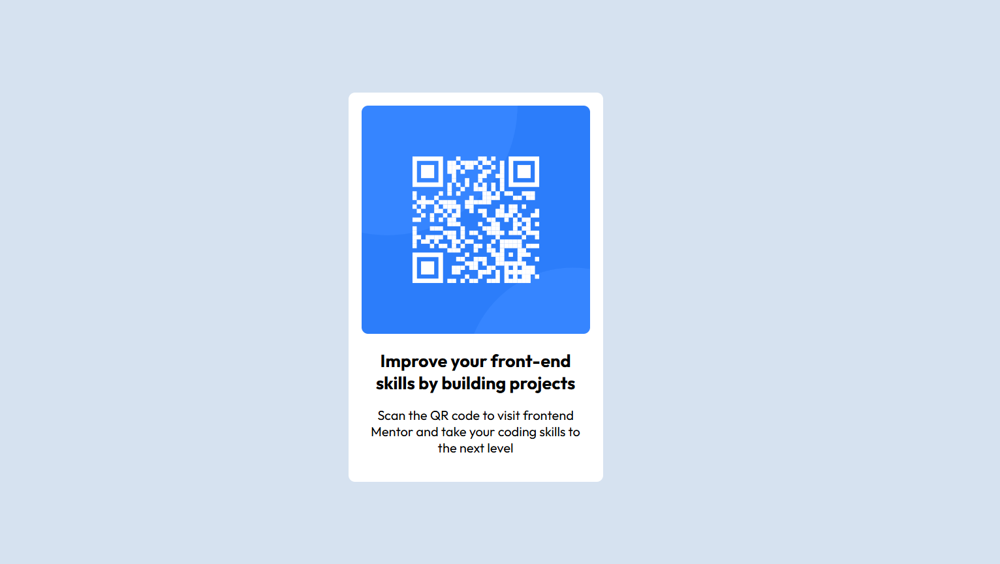

Here's a README for your project, using the provided template:

# Frontend Mentor - QR code component solution

This is a solution to the [QR code component challenge on Frontend Mentor](https://www.frontendmentor.io/challenges/qr-code-component-iux_sIO_H). Frontend Mentor challenges help you improve your coding skills by building realistic projects.

## Table of contents

- [Overview](#overview)
  - [Screenshot](#screenshot)
  - [Links](#links)
- [My process](#my-process)
  - [Built with](#built-with)
  - [What I learned](#what-i-learned)
  - [Continued development](#continued-development)
  - [Useful resources](#useful-resources)
- [Author](#author)
- [Acknowledgments](#acknowledgments)

## Overview

### Screenshot

### Links

- Solution URL: [GitHub](https://github.com/Hilton-J/qr-code-component-main.git)
- Live Site URL: [Vercel](https://qr-code-component-main-nine-cyan.vercel.app/)

## My process

### Built with

- Semantic HTML5 markup
- CSS custom properties
- Flexbox
- Mobile-first workflow

### What I learned

During this project, I learned how to effectively use CSS Flexbox to create a responsive layout. Here are some code snippets that I am proud of:

-- HTML

<body>
    

      

      <h1>Improve your front-end skills by building projects</h1>
      

        Scan the QR code to visit frontend Mentor and take your coding skills to
        the next level
      

    

  </body>

-- CSS
body {
display: flex;
justify-content: center;
align-items: center;
height: 100vh;
background-color: hsl(212, 45%, 89%);
font-family: "Outfit", dans-serif;
font-size: 15px;
}

.container {
background: hsl(0, 0%, 100%);
border-radius: 10px;
padding: 20px;
max-width: 350px;
text-align: center;
}

.card_image {
width: 100%;
height: auto;
border-radius: 10px;
}

h1 {
margin: 20px 0;
font-weight: 700;
font-size: 27px;
}

p {
font-weight: 400;
font-size: 20px;
}

/_ Responsive Design _/
@media (max-width: 320px) {
body {
margin: 0 10px;
}

.container {
padding: 20px;
}

h1 {
font-size: 22.5px;
}

p {
font-size: 15.5px;
}
}

### Continued development

In future projects, I plan to continue improving my understanding of responsive design principles and to explore more advanced CSS techniques.

### Useful resources

- [CSS Tricks](https://css-tricks.com/) - This website helped me understand Flexbox better and provided many useful examples.
- [MDN Web Docs](https://developer.mozilla.org/) - A great resource for web development documentation and guides.

## Author

- Frontend Mentor - [@Hilton-J](https://www.frontendmentor.io/profile/Hilton-J)

## Acknowledgments

Thanks to the Frontend Mentor community for their feedback and support. Their insights were invaluable in completing this project.

Feel free to scrutinise the code and advise on where I can improve, modify and update this template to better suit your project and personal preferences!
